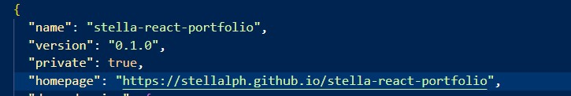
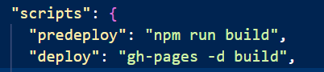

## Portfolio

[](https://opensource.org/licenses/MIT)

## Description

This portfolio is a single page application and have been refactored from 20s-react-portfolio by using React, React icons, HTML and Styled Components and a place to share six of my projects.

This application is deployed to GitHub Pages and the URL of the functional deployed application is https://stellalph.github.io/stella-react-portfolio.

The repository name is stella-react-portfolio and the URL of the GitHub repository is https://github.com/stellalph/stella-react-portfolio.git.

## Table of Contents

- [Installation](#installation)
- [Deployment](#deployment)
- [Overview](#overview)
- [License](#license)

## Installation

1.  This portfolio application requires the installation of node.js from the website, https://www.node.js and the node package manager(npm) which is a software manager and installer which puts the modules so that the node project can utilize it, and also, it manages dependency conflicts intelligently and initialized using **npm init**". The package.json will be generated and will contains all the details of the application in which the user have inputted during the npm initialization.

2.  This react application is created by entering at command prompt :-

    - npx create-react-app stella-react-portfolio
    - npm install
    - npm start (run the apps in the development and http://localhost:3000 to view it in the browser)
    - npm install react-icons --save (for including the popular icons easily with react-icons which utilizes ES6 imports that allows inclusion of icons    for this application)
    - npm install @emailjs/browser
    - npm run build (builds the app for production to the folder to correctly bundles React in production mode and optimizes the build for the best performance)
    - npm install validator (to validate the email)
    - npm i styled-components@4.1.3
    - npm install --save @types/styled-components

## Deployment

- To deploy the react application, we add the homepage to package.json:-

  

- To install gh-pages and add deploy to scripts in package.json

  ```
  npm install --save gh-pages
  ```

  

- To deploy to the site by running

  ```
  npm run deploy
  ```    
## Overview

## License

This project is licensed under the terms of the MIT license
